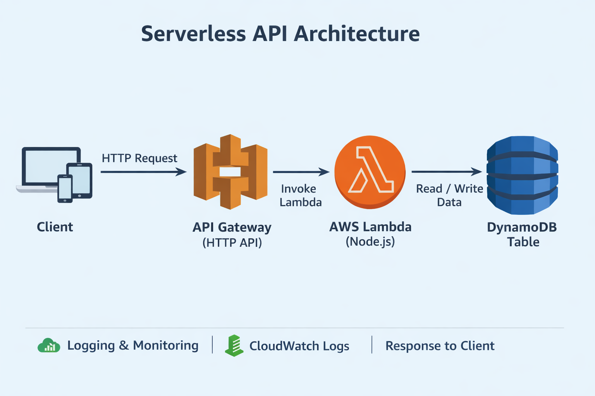

# Project2 Serverless API

Project Overview---

    Project2 Serverless API is a fully serverless backend built on AWS to manage products (items) via a CRUD interface.

-API Type: HTTP API (API Gateway)

-Backend: AWS Lambda (Node.js 18)

-Database: DynamoDB (On-Demand)

-Infrastructure as Code: Terraform

-CI/CD Automation: GitHub Actions

-This project demonstrates the use of serverless architecture, Infrastructure as Code, and automated deployments, providing a scalable, cost-efficient API without managing servers.

# Architecture

Flow: Client → API Gateway (HTTP API) → Lambda (Node.js) → DynamoDB → Response

Details:

1: Client sends GET/POST requests for product items

2: API Gateway routes requests to a single Lambda function

3: Lambda handles business logic and interacts with DynamoDB

4: Response is returned to the client

5: CloudWatch logs capture execution details for monitoring

### 🖼 Architecture Diagram

# Tech Stack

* AWS Services:

            -API Gateway (HTTP API)

            -Lambda (Node.js 18)

            -DynamoDB (On-Demand, encrypted)

            -CloudWatch Logs

* Infrastructure as Code: Terraform (multiple .tf files)

* CI/CD: GitHub Actions

* Security: Custom IAM role for Lambda, least privilege applied

# Features:

    -Fully serverless architecture

    -Single Lambda function handling multiple routes

    -Product CRUD API (GET /items, POST /items)

    -Terraform-managed infrastructure with remote S3 backend and state locking

    -Automated CI/CD pipeline using GitHub Actions

    -CloudWatch logging enabled for monitoring

    -Public API for demonstration purposes

# Project Structure:

project2-serverless-api/
├── terraform/
│   ├── lambda.tf
│   ├── api.tf
│   ├── dynamodb.tf
│   ├── iam.tf
│   ├── backend.tf
│   └── outputs.tf
├── lambda/
│   └── handler.js
├── .github/workflows/
│   └── deploy.yml
└── README.md

# Infrastructure (Terraform):

--Terraform provisions:

API Gateway HTTP API with GET/POST routes,

Lambda function with a custom execution role,

DynamoDB table (product-table) with partition key productId,

--IAM Role & Policy:

Project2 Lambda Execution Role with AWSLambdaBasicExecutionRole-

Custom policy granting DynamoDB access,

--Remote backend: S3 bucket + DynamoDB table for state locking,

--Why Terraform?

Infrastructure is version-controlled,

Easy to reproduce environments,

Supports automated CI/CD deployments,

# CI/CD Pipeline (GitHub Actions)
The pipeline runs automatically on push to main branch:

Configures AWS credentials from GitHub Secrets

Runs terraform fmt to format code

Runs terraform validate to check syntax

Runs terraform plan to preview changes

Runs terraform apply to deploy infrastructure

Deploys updated Lambda function automatically

This ensures fully automated, consistent, and repeatable deployments.

# API Endpoints

Method	Endpoint	Description
GET	/items	Retrieve all products
POST	/items	Create a new product

Note: Authentication is not implemented; API is publicly accessible.

# Authentication & Authorization

API Gateway HTTP API supports IAM and JWT authorizers

Currently, no authentication is configured (public API)

Lambda has a custom IAM role with least privilege to access DynamoDB and CloudWatch

Authentication can be added in the future via:

IAM authorization

JWT authorizer

Amazon Cognito

# Monitoring & Logging:

CloudWatch logs enabled for Lambda execution

API Gateway logs enabled for request tracing

No alarms configured (can be added in future enhancements)

# Deployment Instructions:

1: Clone Repository

<code> git clone https://github.com/yourusername/project2-serverless-api.git
cd project2-serverless-api

2: Configure AWS Credentials
<code> aws configure
Or use GitHub Secrets for CI/CD deployment.

3: Initialize Terraform
<code> terraform init

4: terraform apply
<code>
terraform apply

# Future Improvements

Add API authentication (JWT or IAM-based)

Add more CRUD endpoints (PUT, DELETE)

Add request throttling and usage plans

Configure alarms and enhanced monitoring

Use Terraform modules for cleaner structure

Add environment separation (dev/prod)

# Author

bushra alia
Certified AWS Cloud Practitioner / Solutions Architect
LinkedIn: www.linkedin.com/in/bushra-alia-25aa503b1

Email: zunaishacreations@gmail.com